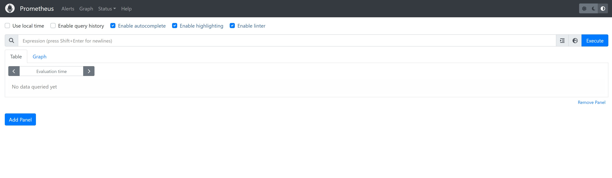
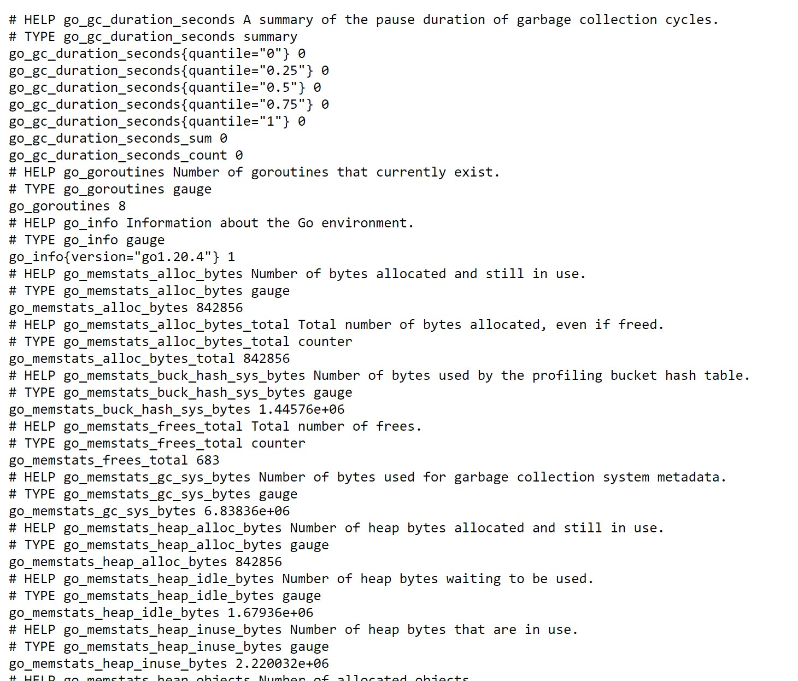
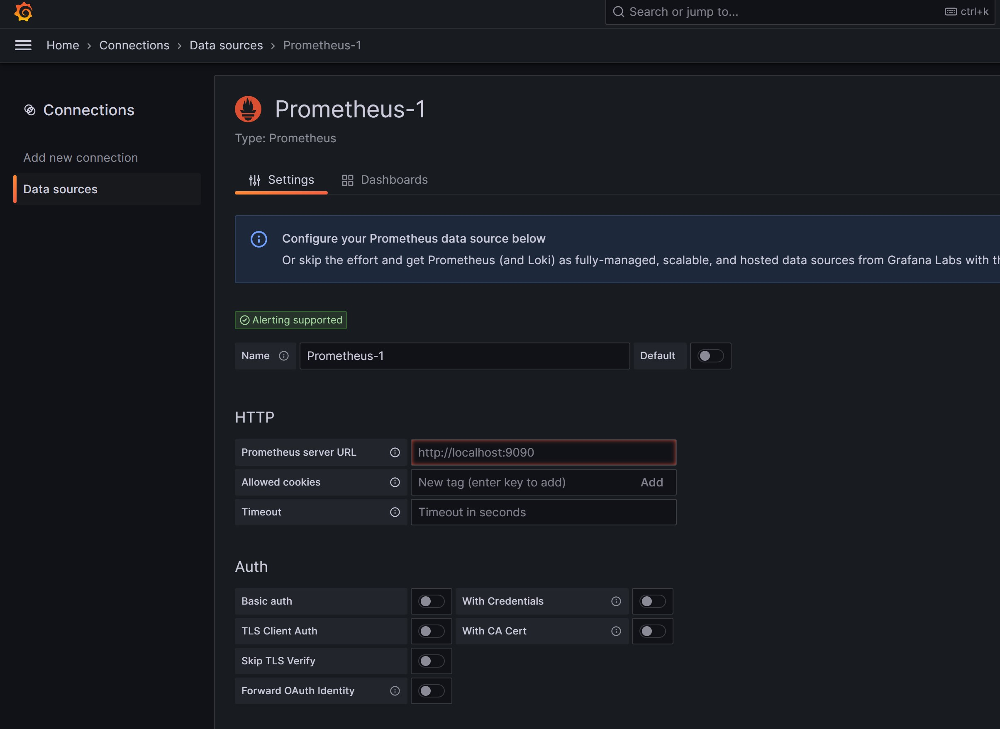
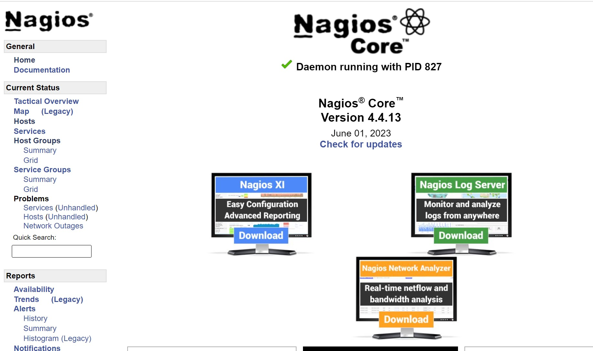

## Several Linux projects <!-- omit from toc -->

- [Using Prometheus, Node Exporter, and grafana to Monitor a Linux server.](#using-prometheus-node-exporter-and-grafana-to-monitor-a-linux-server)
  - [Steps for installing prometheus on the monitoring server.](#steps-for-installing-prometheus-on-the-monitoring-server)
  - [Steps for installing Node Exporter on the monitored server.](#steps-for-installing-node-exporter-on-the-monitored-server)
  - [Steps for using the prometheus server to monitor the client server.](#steps-for-using-the-prometheus-server-to-monitor-the-client-server)
  - [Install and configure Grafana on the monitoring server](#install-and-configure-grafana-on-the-monitoring-server)
  - [Reverse proxy and https](#reverse-proxy-and-https)
- [Using Nagios core, Nagios Plugins, and Nagios Remote Plugin Executor (NRPE) to monitor a Linux server.](#using-nagios-core-nagios-plugins-and-nagios-remote-plugin-executor-nrpe-to-monitor-a-linux-server)
  - [Installing Nagios Core from source on the monitoring server.](#installing-nagios-core-from-source-on-the-monitoring-server)
  - [Installing Nagios Plugin on the Nagios server.](#installing-nagios-plugin-on-the-nagios-server)
  - [Installing Nagios Plugins and NRPE On Remote Linux Host](#installing-nagios-plugins-and-nrpe-on-remote-linux-host)
### Using Prometheus, Node Exporter, and grafana to Monitor a Linux server.
Two servers are needed for this project.
#### Steps for installing prometheus on the monitoring server.
1. Server 1 with hostname `lab05-prometheus.cezeh.dev` will be used to monitor server 2 the client server `lab05-client.cezeh.dev`. Both Linux servers will be running AlmaLinux 9
2. Create the two servers and update them as necessary, you can use this opportunity to set the hostnames using `hostnamectl set-hostname <your-FQDN>`
3. Go to the prometheus [website](https://prometheus.io/download/), right click on the most stable version for Linux OS and copy the link address.
4. Using the following command `wget https://github.com/prometheus/prometheus/releases/download/v2.44.0/prometheus-2.44.0.linux-amd64.tar.gz` download the tar file from the step above. You might need to install wget if your system doesn't have it.
5. Extract the downloaded tar file `tar -xvzf prometheus-2.44.0.linux-amd64.tar.gz`
6. Create a user with no shell and home page that the prometheus application will use.
   `useradd --no-create-home --shell /bin/false prometheus`
7. We need to create several directories to store our configuration files for prometheus, and change the ownership to the prometheus user created above.
 ```console
 mkdir /etc/prometheus && chown prometheus:prometheus /etc/prometheus
 mkdir /var/lib/prometheus && chown prometheus:prometheus /var/lib/prometheus
 ```
8. Navigate into the extracted folder from step 5 above `cd prometheus-2.44.0.linux-amd64`
9. We will need to copy the binaries in the `prometheus` and `promtool` files into the `/usr/local/bin`folder and make changes to the ownership.
```console
cp prometheus /usr/local/bin && chown prometheus:prometheus /usr/local/bin/prometheus
cp promtool /usr/local/bin && chown prometheus:prometheus /usr/local/bin/promtool
``` 
10. Also, copy the `consoles` and `console_libraries` to the configuration folder and change the ownership.
```console
cp -r consoles /etc/prometheus/ && chown -R prometheus:prometheus /etc/prometheus/consoles
cp -r console_libraries /etc/prometheus/ && chown -R prometheus:prometheus /etc/prometheus/console_libraries
```
11. Configure the prometheus server to monitor itself, we will makes changes to this file later when we want to monitor the client machine. `vi /etc/prometheus/prometheus.yml`
```vim
global:
  scrape_interval: 10s
  scrape_configs:
  - job_name: 'prometheus_monitor'
    scrape_interval: 5s
    static_configs:
      - targets: ['localhost:9090']

```
12. Change the ownership of the configuration file from the step above. `chown prometheus:prometheus /etc/prometheus/prometheus.yml`
13. Configure the systemd file for prometheus so we can start it as a service.`vi /etc/systemd/system/prometheus.service`
```vim
[Unit]
Description=Prometheus
Wants=network-online.target
After=network-online.target

[Service]
User=prometheus
Group=prometheus
Type=simple
ExecStart=/usr/local/bin/prometheus \
  --config.file=/etc/prometheus/prometheus.yml \
  --storage.tsdb.path=/var/lib/prometheus \
  --web.console.templates=/etc/prometheus/consoles \
  --web.console.libraries=/etc/prometheus/console_libraries

[Install]
WantedBy=multi.target

```
14. Start the prometheus service by doing the following commands below.
```console
systemctl daemon-reload
systemctl start prometheus
systemctl status prometheus
systemctl enable prometheus
```
15. To access your prometheus web console, go to `http://<your_ip>:9090`, if all the configuration is done correctly, you should see an interface like the image below.


#### Steps for installing Node Exporter on the monitored server.
To monitor a client server using prometheus, we will need to install and configure Node Exporter on the client server. The steps for doing that is outlined below.
1. Navigate to the download [page](https://prometheus.io/download/) of prometheus, then look for the latest stable version of node exporter.
2. Use wget to download the tar file, ` wget https://github.com/prometheus/node_exporter/releases/download/v1.6.0/node_exporter-1.6.0.linux-amd64.tar.gz`
3. Create a node exporter user, `useradd -rs /bin/false nodeusr`
4. Extract the downloaded node exporter tar file, `tar xvzf node_exporter-1.6.0.linux-amd64.tar.gz`
5. Navigate into the folder created from the step above, `cd node_exporter-1.6.0.linux-amd64`
6. Move the node_exporter file to the binaries location, `mv node_exporter /usr/local/bin`
7. Change the ownership of the binaries copied in the above step, `chown nodeusr:nodeusr /usr/local/bin/node_exporter`
8. Create the systemd file for node_exporter, `vim /etc/systemd/system/node_exporter.service`, enter the following entries below
```vim
[Unit]
Description=Node Exporter
Wants=network-online.target
After=network-online.target
[Service]
User=nodeusr
Group=nodeusr
Type=simple
ExecStart=/usr/local/bin/node_exporter
[Install]
WantedBy=multi-user.target
```
9. Start the node_exporter service;

```console
systemctl daemon-reload
systemctl start node_exporter
systemctl status node_exporter
systemctl enable node_exporter
```
10. Enable node_exporter through firewall.

```console
firewall-cmd --add-port=9100/tcp --zone=public --permanent
firewall-cmd --reload
```
11. Go to this endpoint `http://<your_ip>:9100/metrics` if everything is configured correctly you should see the image below showing some system parameters. The endpoint can then be configured in the prometheus server to pull data from the client server.



#### Steps for using the prometheus server to monitor the client server.
At this step, we should have a monitoring server with prometheus installed and configured. Also, we should have a client server with node exporter running. We can use the steps below to combine both machines, and monitor the client machine using the prometheus machine.
1. Edit the prometheus config file and add the values for the client server, `vim /etc/prometheus/prometheus.yml`
```vim
global:
  scrape_interval: 10s
scrape_configs:
  - job_name: 'prometheus_monitor'
    scrape_interval: 5s
    static_configs:
      - targets: ['localhost:9090']
  - job_name: 'lab05-client'
    scrape_interval: 5s
    static_configs:
      - targets: ['<ip_address_of_client>:9100']
```
2. Restart the prometheus service, `systemctl restart prometheus`

3. Verify that the connection has been established by going to the following address, `http://monitoring_ip:9090/targets`, you should see the client machine and the prometheus machine showing up.

#### Install and configure Grafana on the monitoring server
Final step would be to install and configure grafana so we can create a dashboard quickly for different metrics we are interested in.
1. Create a grafana repo, `vim /etc/yum.repos.d/grafana.repo` and add the contents below.
```vim
[grafana]
name=grafana
baseurl=https://rpm.grafana.com
repo_gpgcheck=1
enabled=1
gpgcheck=1
gpgkey=https://rpm.grafana.com/gpg.key
sslverify=1
sslcacert=/etc/pki/tls/certs/ca-bundle.crt
```
2. Install grafana, `yum install grafana`
3. Verify that grafana was installed `rpm -qi grafana`
4. Start the grafana service

```console
systemctl start grafana-server
systemctl status grafana-server
systemctl enable grafana-server
```
5. Enable port 3000 through firewall `firewall-cmd --add-port=3000/tcp --permanent`
6. Reload firewall, `firewall-cmd --reload`
7. Go to `http:<ip>:3000` you should be welcomed with the grafana sign in page like below. The default username and passwd is admin admin, you will be prompted to change this password at first login.


8. Once you are logged into grafana, look for data connections, search for prometheus, then add the prometheus end point (http://prometheus_ip:9090) to the Prometheus server url field.

9. Next step is to create a dashboard with the new data connection, have fun experimenting!

#### Reverse proxy and https

1. Install nginx web server, `yum install nginx -y`
2. Start the web server, `systemctl start nginx`
3. Enable the web server at startup `systemctl enable nginx`
4. Enable http and https through firewall,`firewall-cmd --add-service={http,https} --permanent`
5. Reload the firewall `firewall-cmd --reload`
6. Make a directory to contain your grafana website config, `mkdir /etc/nginx/sites-enabled`
7. Open the global nginx configuration `vim /etc/nginx/nginx.conf`
8. Add this `include /etc/nginx/sites-enabled/*;` to the http section of the nginx.conf file, your http section of the configuration file should look like below:
```console

http {
    log_format  main  '$remote_addr - $remote_user [$time_local] "$request" '
                      '$status $body_bytes_sent "$http_referer" '
                      '"$http_user_agent" "$http_x_forwarded_for"';

    access_log  /var/log/nginx/access.log  main;

    sendfile            on;
    tcp_nopush          on;
    tcp_nodelay         on;
    keepalive_timeout   65;
    types_hash_max_size 4096;

    include             /etc/nginx/mime.types;
    default_type        application/octet-stream;

    # Load modular configuration files from the /etc/nginx/conf.d directory.
    # See http://nginx.org/en/docs/ngx_core_module.html#include
    # for more information.
    include /etc/nginx/conf.d/*.conf;
    include /etc/nginx/sites-enabled/*;

    server {
        listen       80;
        listen       [::]:80;
        server_name  _;
        root         /usr/share/nginx/html;

        # Load configuration files for the default server block.
        include /etc/nginx/default.d/*.conf;

        error_page 404 /404.html;
        location = /404.html {
        }

        error_page 500 502 503 504 /50x.html;
        location = /50x.html {
        }
    }

```
9. Navigate to the folder we created earlier to contain grafana website configuration, `cd /etc/nginx/sites-enabled`
10. The file format is the fully qualified domain name.conf, `vim FQDN.conf`
11. Add the following content to the config file. We will create the self signed certificate in a separate step, however, if you change the name and location of your self signed certificate and key, change that in the config file.

```console
server {
    listen 443 ssl;
    server_name  <grafana_ip>;
    ssl_certificate /etc/nginx/self-signed.crt;
    ssl_certificate_key /etc/nginx/self-signed.key;

    location / {
        proxy_set_header Host $http_host;
        proxy_pass           http://<grafana_ip>:3000/;
    }

}
server {
    listen 80;
    server_name <grafana_ip>;

    # Redirect HTTP to HTTPS
    return 301 https://$host$request_uri;
}
```
12. Create ssl certificate and key using openssl, `openssl req -x509 -nodes -days 365 -newkey rsa:2048 -keyout /etc/nginx/self-signed.key -out /etc/nginx/self-signed.crt`
13. `nginx -t` to test nginx configuration
14. If no error, restart the nginx server,`systemctl restart nginx`

### Using Nagios core, Nagios Plugins, and Nagios Remote Plugin Executor (NRPE) to monitor a Linux server.

Two separate servers will be used for this project, one will be the Nagios host and the other will be a remote client that will be monitored by the Nagios host, both machines will be running AlmaLinux 9.

#### Installing Nagios Core from source on the monitoring server.

The Nagios [website](https://support.nagios.com/kb/article/nagios-core-installing-nagios-core-from-source-96.html#RHEL) has the steps for installing Nagios core on various Linux distributions, however we will need to make some modifications to be able to install it on AlmaLinux 9. The steps will be outlined below.

1. Update your new Linux server using `dnf update -y` and set the hostname to a FQDN `hostnameclt set-hostname FQDN`
2. Disable SELinux before proceeding (caution only do this on non-production server, or follow what your company policies are) `setenfore 0`, then edit the SELinux config file `vi /etc/selinux/config`, change `SELINUX=enforcing` to `SELINUX=permissive`.
3. Install the pre-requisite packages, 
   >`yum install -y gcc glibc glibc-common wget unzip httpd php gd gd-devel perl postfix`
   `yum install openssl-devel`
4. Navigate to `/tmp`, `cd /tmp`
5. Download the latest version of Nagios core using wget; 
   `wget https://assets.nagios.com/downloads/nagioscore/releases/nagios-4.4.13.tar.gz`
6. Extract the downloaded tar file.
    `tar xvzf nagios-4.4.13.tar.gz`
7. Navigate to the extracted folder `cd nagios-4.4.13`
8. Compile the Nagios code
   ```console
   ./configure
   make all
   ```
9. Create a `nagios` user and group, then modify the `apache` user to be added to the `nagios` group.
    ```console
    make install-group-users
    usermod -a -G nagios apache
    ```
10. Install the binaries, CGIs, and HTML files `make install`
11. Install and enable services
    ```console
      make install-daemoninit
      systemctl enable httpd
    ```
12. Install command mode `make install-commandmode`
13. Install configuration files `make install-config`
14. Install Apache Config `make install-webconf`
15. Configure firewall
    ```console
      firewall-cmd --zone=public --add-port=80/tcp --add-service={http,https} --permanent
      firewall-cmd --reload
    ```
16. Create a `nagiosadmin` user that will be used to log into the web interface, once you run the command below, you will be asked to enter in a password, that password will be used to log into the webinterface so remember it.
    `htpasswd -c /usr/local/nagios/etc/htpasswd.users nagiosadmin`
17. Start your `httpd` and `nagios` service.
    ```console
    systemctl start httpd
    systemctl status httpd
    systemctl start nagios.service
    systemctl status nagios.service
    ```
18. If both services are running without any errors, navigate to the following url to access your Nagios web interface. `http://<nagios_server_ip>/nagios`, you will be greeted with a pop up to enter the username and password (nagiosadmin and the password we created earlier.)
19. Once you log in successfully, you should see a page like the image below.


20. We only have the Nagios core engine currently installed, so we won't be able to talk to any hosts including the server running Nagios. To be able to communicate with servers, we need to install Nagios pluggins.

#### Installing Nagios Plugin on the Nagios server.
1. Install the pre-requisite packages.
    ```console
    dnf install -y gcc glibc glibc-common openssl-devel perl wget gettext make net-snmp net-snmp-utils automake autoconf epel-release libpqxx-devel
    yum --enablerepo=epel install perl-Net-SNMP
    ```
2. Navigate into the /tmp directory `cd /tmp`
3. Use `wget` to download the source code for Nagios plugin, as at this writing the`2.4.4` version of the Nagios plugin throws an error of `ERROR: Could not determine OS. Please make sure lsb_release is installed`. We will use version `2.3.3` for this installation;
`wget --no-check-certificate -O nagios-plugins.tar.gz https://github.com/nagios-plugins/nagios-plugins/archive/release-2.3.3.tar.gz`
4. Extract the downloaded file; `tar zxf nagios-plugins.tar.gz`
5. Navigate to the extracted folder `cd /tmp/nagios-plugins-release-2.3.3`
6. Compile and Install the Nagios plugin
   ```console
   ./tools/setup
   ./configure
   make
   make install
   ```
7. Restart Nagios `systemctl restart nagios`
8. Test your Nagios by going to the web interface `http://<nagios_ip>/nagios`

#### Installing Nagios Plugins and NRPE On Remote Linux Host
To monitor a Linux machine with the Nagios server we configured earlier, we will need to install `Nagios Plugins` on the remote machine and also install `NRPE`. The remote Linux machine (also called client machine) doesn't need the Nagios core installed.
1. Install the pre-requisite packages
   ```console
   yum install -y gcc glibc glibc-common gd gd-devel make net-snmp openssl-devel make automake autoconf net-snmp-utils epel-release
   yum --enablerepo=epel install perl-Net-SNMP -y
   ```
2. Create the user for Nagios, and set the password
   ```console
   useradd nagios
   passwd nagios
   ```
3. Download Nagios plugin
    ```console
    wget --no-check-certificate -O nagios-plugins.tar.gz https://github.com/nagios-plugins/nagios-plugins/archive/release-2.3.3.tar.gz
    ```
4. Extract the downloaded file `tar xzvf nagios-plugins.tar.gz`
5. Navigate to the extracted directory `cd nagios-plugins-release-2.3.3`
6. Compile and install the Nagios plugin
    ```console
   ./tools/setup
   ./configure
   make
   make install
   ```
7. Change the ownership of the plugins directory to the Nagios user.
    ```console
    chown nagios.nagios /usr/local/nagios
    chown -R nagios.nagios /usr/local/nagios/libexec
    ```
    