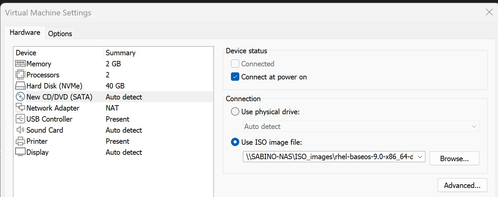
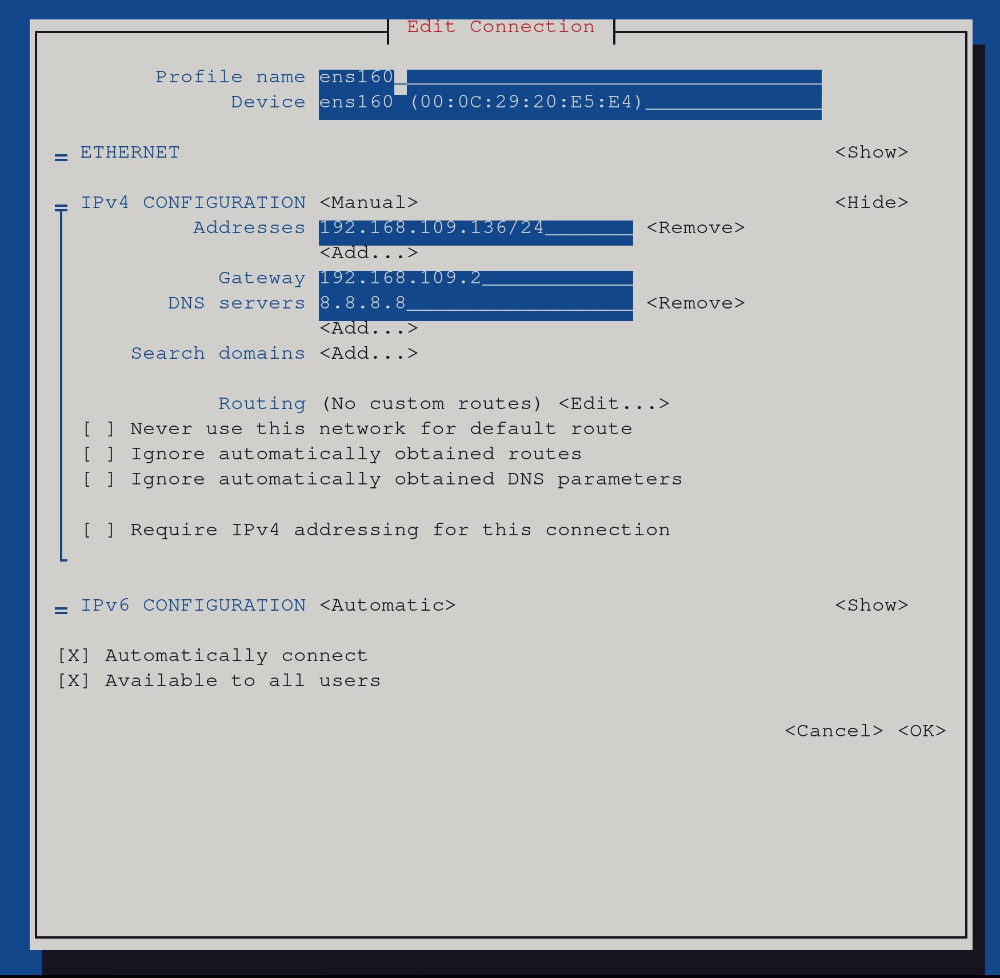

#### Lab Creation

This contains steps to manually create a lab for RHCSA practice.

##### Creating a Repo VM.
Note there are various ways to accomplish this, however we will be using the original disk image and a webserver to serve the base repo that comes with the RHEL9 iSO.

1. Create a RHEL9 VM on your favorite Hypervisor, I will be using VMware Workstation.
2. Add a CD/DVD device to the VM when it is powered off, and attach the RHEL9 ISO. 
   
3. Power on the VM.
4. Run `blkid` if you mounted the ISO image correctly it should show up as a device with path `/dev/sr0` as below:
```console
[root@repo ~]# blkid
/dev/mapper/rhel-swap: UUID="aeb704ce-69c4-4247-88d4-253ad3c3d71b" TYPE="swap"
/dev/nvme0n1p1: UUID="e65c1fa1-27d3-405c-8ac9-ccfce80b3e14" BLOCK_SIZE="512" TYPE="xfs" PARTUUID="5f8ec671-01"
/dev/nvme0n1p2: UUID="a517bQ-yFKG-i976-uVIb-lNp0-pmy4-7elQbR" TYPE="LVM2_member" PARTUUID="5f8ec671-02"
/dev/sr0: BLOCK_SIZE="2048" UUID="2022-08-05-06-19-40-00" LABEL="RHEL-9-0-0-BaseOS-x86_64" TYPE="iso9660" PTUUID="60d19322" PTTYPE="dos"

```

5. Set a hostname for your repo vm if you don't have a hostname. `hostnamectl set-hostname repo.lab.exam
`
6. Run `lsblk` to get the current mount point of your ISO image. 
```console
[root@repo ~]# lsblk
NAME          MAJ:MIN RM  SIZE RO TYPE MOUNTPOINTS
sr0            11:0    1  7.9G  0 rom  /run/media/cezeh/RHEL-9-0-0-BaseOS-x86_64
nvme0n1       259:0    0   40G  0 disk 
├─nvme0n1p1   259:1    0    1G  0 part /boot
└─nvme0n1p2   259:2    0   39G  0 part 
  ├─rhel-root 253:0    0   37G  0 lvm  /
  └─rhel-swap 253:1    0    2G  0 lvm  [SWAP]
```
7. Make a repo directory, we will be using this in a later step. `mkdir /repo`
8. The path I got in step 6 `/run/media/cezeh/RHEL-9-0-0-BaseOS-x86_64` contains the repos `AppStream` and `BaseOS`. copy all the files in the disk to the `/repo` directory. `cp -r /run/media/cezeh/RHEL-9-0-0-BaseOS-x86_64/* /repo`.
9. Steps 10 to 11 are needed if you haven't registered your RHEL9 system with Redhat, run `yum repolist` if you get the output below, it means you haven't registered your VM with RedHat. So we will need to create a local repository to be able to install a webserver `httpd`. If your VM is registered to RedHat then skip to step 12. 
    ```console
    [root@repo ~]# yum repolist
    Updating Subscription Management repositories.
    Unable to read consumer identity

    This system is not registered with an entitlement server. You can use subscription-manager to register.

    No repositories available
    ```
10. Create a two local repos by typing out the below line by line and pressing enter at the last `EOF` for each repo. 
    1.  AppStream
    ```console
    cat <<EOF > /etc/yum.repos.d/AppStream.repo
    [AppStream]                                
    name=AppStream
    baseurl=file:///repo/AppStream
    gpgcheck=0
    EOF
    ```
    2.  BaseOS
    ```console
    cat <<EOF > /etc/yum.repos.d/BaseOS.repo
    [BaseOS]                                
    name=BaseOS
    baseurl=file:///repo/BaseOS
    gpgcheck=0
    EOF
    ```
11. Confirm that the repos were successfully created, you should get the output below when you run `yum repolist -v`
    ```console
    [root@repo ~]# yum repolist -v
    Loaded plugins: builddep, changelog, config-manager, copr, debug, debuginfo-install, download, generate_completion_cache, groups-manager, kpatch, needs-restarting, playground, product-id, repoclosure, repodiff, repograph, repomanage, reposync, subscription-manager, uploadprofile
    Updating Subscription Management repositories.
    Unable to read consumer identity

    This system is not registered with an entitlement server. You can use subscription-manager to register.

    YUM version: 4.10.0
    cachedir: /var/cache/dnf
    AppStream                                                                                                                                103 MB/s | 5.8 MB     00:00    
    BaseOS                                                                                                                                   100 MB/s | 1.7 MB     00:00    
    Repo-id            : AppStream
    Repo-name          : AppStream
    Repo-revision      : 1659679633
    Repo-updated       : Thu 04 Aug 2022 11:07:13 PM MST
    Repo-pkgs          : 5,272
    Repo-available-pkgs: 5,272
    Repo-size          : 6.2 G
    Repo-baseurl       : file:///repo/AppStream
    Repo-expire        : 172,800 second(s) (last: Sat 20 Sep 2025 02:35:20 PM MST)
    Repo-filename      : /etc/yum.repos.d/AppStream.repo

    Repo-id            : BaseOS
    Repo-name          : BaseOS
    Repo-revision      : 1659679688
    Repo-updated       : Thu 04 Aug 2022 11:08:11 PM MST
    Repo-pkgs          : 1,131
    Repo-available-pkgs: 1,131
    Repo-size          : 929 M
    Repo-baseurl       : file:///repo/BaseOS
    Repo-expire        : 172,800 second(s) (last: Sat 20 Sep 2025 02:35:21 PM MST)
    Repo-filename      : /etc/yum.repos.d/BaseOS.repo
    Total packages: 6,403

    ```
12. Install Apache webserver `yum install httpd -y`
13. Copy the files from `/repo` to our web directory `/var/www/html`. `cp -r /repo /var/www/html/repo`. Note we could make our web server point to the `/repo` directory, but this will involve changing the SELINUX file context and making changes to the httpd config, this is left as a practice for whoever is following this guide. 
14. Change the ownership of the web directory to apache to prevent any permission issues. `chown -R apache:apache /var/www/html/repo`
15. Update the permissions of the web directory. `chmod -R 755 /var/www/html/repo`
16. Make your VM have a static IP address, I used nmtui. Feel free to use whatever technique you are comfortable with. 
Tip: use `ip a` to get your current dynamic ip, use `ip route show` to get your Gateway. I used `8.8.8.8` for the DNS servers.

17. Now we can start our webserver, `systemctl enable --now httpd`
18. To use a hostname, edit `/etc/hosts` file and add your IP address.
    ```console
    [root@repo ~]# cat <<EOF >> /etc/hosts
    192.168.109.135 repo.lab.exam repo
    EOF
    ```
19. We can now edit our initial repo files to use our webserver. It should look like this now:
    ```
    [AppStream]
    name=AppStream
    baseurl=http://repo.lab.exam/repo/AppStream
    gpgcheck=0

    ```
    ```
    [BaseOS]
    name=BaseOS
    baseurl=http://repo.lab.exam/repo/BaseOS
    gpgcheck=0

    ```
20. Test your new repo `yum repolist -v`
    ```console
    [root@repo ~]# yum repolist -v
    Loaded plugins: builddep, changelog, config-manager, copr, debug, debuginfo-install, download, generate_completion_cache, groups-manager, kpatch, needs-restarting, playground, product-id, repoclosure, repodiff, repograph, repomanage, reposync, subscription-manager, uploadprofile
    Updating Subscription Management repositories.
    Unable to read consumer identity

    This system is not registered with an entitlement server. You can use subscription-manager to register.

    YUM version: 4.10.0
    cachedir: /var/cache/dnf
    AppStream                                                                                                                                126 MB/s | 5.8 MB     00:00    
    BaseOS                                                                                                                                    96 MB/s | 1.7 MB     00:00    
    Repo-id            : AppStream
    Repo-name          : AppStream
    Repo-revision      : 1659679633
    Repo-updated       : Thu 04 Aug 2022 11:07:13 PM MST
    Repo-pkgs          : 5,272
    Repo-available-pkgs: 5,272
    Repo-size          : 6.2 G
    Repo-baseurl       : http://repo.lab.exam/repo/AppStream
    Repo-expire        : 172,800 second(s) (last: Sat 20 Sep 2025 03:31:35 PM MST)
    Repo-filename      : /etc/yum.repos.d/AppStream.repo

    Repo-id            : BaseOS
    Repo-name          : BaseOS
    Repo-revision      : 1659679688
    Repo-updated       : Thu 04 Aug 2022 11:08:11 PM MST
    Repo-pkgs          : 1,131
    Repo-available-pkgs: 1,131
    Repo-size          : 929 M
    Repo-baseurl       : http://repo.lab.exam/repo/BaseOS
    Repo-expire        : 172,800 second(s) (last: Sat 20 Sep 2025 03:31:35 PM MST)
    Repo-filename      : /etc/yum.repos.d/BaseOS.repo
    Total packages: 6,403

    ```
21. Enable our webserver to be reachable from other VMs in the same local area network by enabling httpd via firewalld. `firewall-cmd --add-service=http --permanent`, `firewall-cmd --reload`, `systemctl restart httpd`.
22. Your two new repos are ready to be used with any other VM in the same local area network as your repo VM. 
    ```python
    http://repo.lab.exam/repo/BaseOS
    http://repo.lab.exam/repo/AppStream
    ```