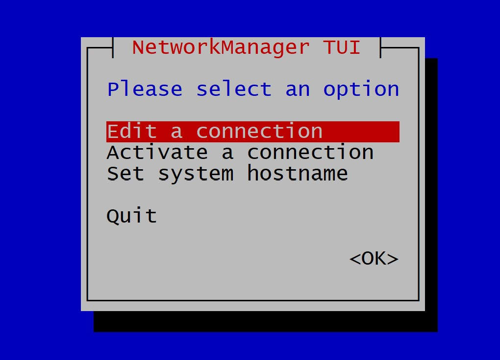

### Week three study note (4/23/2023 - 4/29/2023)<!-- omit from toc -->

#### Network Utilities
##### NetworkManager
This is a service that provides a set of tools designed specifically to make it easier to manage the networking configuration on Linux systems and is the default network management service on RHEL8 and RHEL9.
NetworkManager offers management through different tools.
* GUI
* nmtui
* nmcli

###### nmtui
Typing in the `nmtui` command gives you a menu interface that you can move around using the arrow keys to make selection as shown below.

###### nmcli
You can use `nmcli` for various network related commands.
Showing the difference interfaces.
```console
[flatplanet@almanode1 ~]$ nmcli conn
NAME       UUID                                  TYPE      DEVICE  
alma_team  752dae25-64a8-402e-bbe9-8f1f0194bdac  team      nm-team 
ens33      66cb93ff-2bdb-4ff9-b9c8-d1fafeee6ca3  ethernet  ens33   
ens36      25a3e55a-1658-4558-85c7-b3a38ff5baf0  ethernet  ens36
```
Setting a static IP address.
```console
┌──[05:19:44]─[0]─[root@almanode1:~]
└──| nmcli connection modify ens33 ipv4.addresses 192.168.18.130/24
┌──[05:21:24]─[0]─[root@almanode1:~]
└──| nmcli connection modify ens33 ipv4.gateway 192.168.18.1
┌──[05:22:40]─[0]─[root@almanode1:~]
└──| nmcli connection modify ens33 ipv4.method manual
┌──[05:23:25]─[0]─[root@almanode1:~]
└──| nmcli connection modify ens33 ipv4.dns 8.8.8.8
┌──[05:23:56]─[0]─[root@almanode1:~]
└──| nmcli connection down ens33
┌──[05:23:56]─[0]─[root@almanode1:~]
└──| nmcli connection up ens33

```
#### Downloading Files or apps
We can use the `wget` command to download files from a server using the url.

#### Using the curl command
``` console
# curl
# Transfers data from or to a server.
# Supports most protocols, including HTTP, FTP, and POP3.
# More information: <https://curl.se>.

# Download the contents of a URL to a file:
curl http://example.com --output path/to/file

# Download a file, saving the output under the filename indicated by the URL:
curl --remote-name http://example.com/filename

# Download a file, following location redirects, and automatically continuing (r                                                                  esuming) a previous file transfer and return an error on server error:
curl --fail --remote-name --location --continue-at - http://example.com/filename

# Send form-encoded data (POST request of type `application/x-www-form-urlencode                                                                  d`). Use `--data @file_name` or `--data @'-'` to read from STDIN:
curl --data 'name=bob' http://example.com/form

# Send a request with an extra header, using a custom HTTP method:
curl --header 'X-My-Header: 123' --request PUT http://example.com

# Send data in JSON format, specifying the appropriate content-type header:
curl --data '{"name":"bob"}' --header 'Content-Type: application/json' http://ex                                                                  ample.com/users/1234

# Pass a username and password for server authentication:
curl --user myusername:mypassword http://example.com

# Pass client certificate and key for a resource, skipping certificate validatio                                                                  n:
curl --cert client.pem --key key.pem --insecure https://example.com

```
#### File Transfer Protocol (FTP)
FTP is a standard network protocol used for the transfer of computer files between a client and a server on a computer network, it uses the client-server model architecture using separate control and data connections between client and the server. Default port = 21.

#### Secure Copy Protocol
s a network protocol used to securely copy files/folders between Linux (Unix) systems on a network. To transmit, use the scp command line utility, a safer variant of the cp (copy) command.

SCP protects your data while copying across an SSH (Secure Shell) connection by encrypting the files and the passwords. Therefore, even if the traffic is intercepted, the information is still encrypted. See syntax below for how to use `scp`
```console
scp path/to/local_file remote_username@remote_host:path/to/remote_directory
```

#### Remote synchronization (rsync)
rsync is a utility for efficiently transferring and synchronizing files within the same computer or to a remote computer by comparing te modification times and sizes of the files. It is a lot faster than `scp` or `ftp`. 
```console
# rsync
# Transfer files either to or from a remote host (but not between two remote hosts).
# Can transfer single files or multiple files matching a pattern.
# More information: <https://manned.org/rsync>.

# Transfer a file from local to a remote host:
rsync path/to/local_file remote_host:path/to/remote_directory

# Transfer a file from a remote host to local:
rsync remote_host:path/to/remote_file path/to/local_directory

# Transfer a file in [a]rchive (to preserve attributes) and compressed ([z]ipped) mode displaying [v]erbose and [h]uman-readable [P]rogress:
rsync -azvhP path/to/local_file remote_host:path/to/remote_directory

# Transfer a directory and all its contents from a remote host to local:
rsync -r remote_host:path/to/remote_directory path/to/local_directory

# Transfer directory contents (but not the directory itself) from a remote host to local:
rsync -r remote_host:path/to/remote_directory/ path/to/local_directory

# Transfer a directory [r]ecursively, in [a]rchive (to preserve attributes), resolving contained sym[L]inks, and ignoring already transferred files [u]nless newer:
rsync -rauL remote_host:path/to/remote_directory path/to/local_directory

# Transfer a file over SSH and delete remote files that do not exist locally:
rsync -e ssh --delete remote_host:path/to/remote_file path/to/local_file

# Transfer a file over SSH using a different port than the default and show global progress:
rsync -e 'ssh -p port' --info=progress2 remote_host:path/to/remote_file path/to/local_file
source: cheat.sh/rsync
```
#### Installing a package
```yum``` command is used to install packages and it's dependencies from a repository(repo) which could be on the public internet or a dedicated repo server.
```rpm``` command is used to install locally a downloaded package file.

#### Creating a local repository
1. Create a directory to store the repository files. For example, you can create a directory named "myrepo" in the /opt directory:
```console
sudo mkdir /opt/myrepo

```
2. Create a new repository configuration file named "myrepo.repo" using your preferred text editor:
```console
sudo nano /etc/yum.repos.d/myrepo.repo
```
3. In the configuration file, add the following lines:
```console
[myrepo]
name=My Local Repository
baseurl=file:///opt/myrepo
enabled=1
gpgcheck=0

"myrepo" is the name of the repository.
"My Local Repository" is the display name of the repository.
"baseurl" specifies the location of the repository files. Since we created the repository in /opt/myrepo, we use "file:///opt/myrepo" as the baseurl.
"enabled" specifies whether the repository is enabled. Set it to 1 to enable the repository.
"gpgcheck" specifies whether packages should be checked for their GPG signature. Since this is a local repository, we set it to 0 to disable the check.
```
4. Copy the RPM packages you want to add to the repository to the /opt/myrepo directory.
5. Run the following command to create the repository metadata:
``` console
sudo createrepo /opt/myrepo

```
#### Rollback Updates and Patches
When using a VM to run your Linux system, take a snapshot before making updates so you can roll back when needed.
When using physical machine and you need to rollback a package:
* yum install <pachage-name\>
* yum history undo <id\>
```console
┌──[05:25:15]─[0]─[root@almanode1:~]
└──| yum history
ID     | Command line              | Date and time    | Action(s)      | Altered
--------------------------------------------------------------------------------
    31 | install screen -y         | 2023-04-28 05:25 | Install        |    1
┌──[05:26:06]─[0]─[root@almanode1:~]
└──| yum history undo 31
Last metadata expiration check: 23:08:56 ago on Thu 27 Apr 2023 06:17:54.
Dependencies resolved.
==================================================================================================================================================
 Package                          Architecture                     Version                                  Repository                       Size
==================================================================================================================================================
Removing:
 screen                           x86_64                           4.8.0-6.el9                              @epel                           957 k

Transaction Summary
==================================================================================================================================================
Remove  1 Package

Freed space: 957 k
Is this ok [y/N]:
```