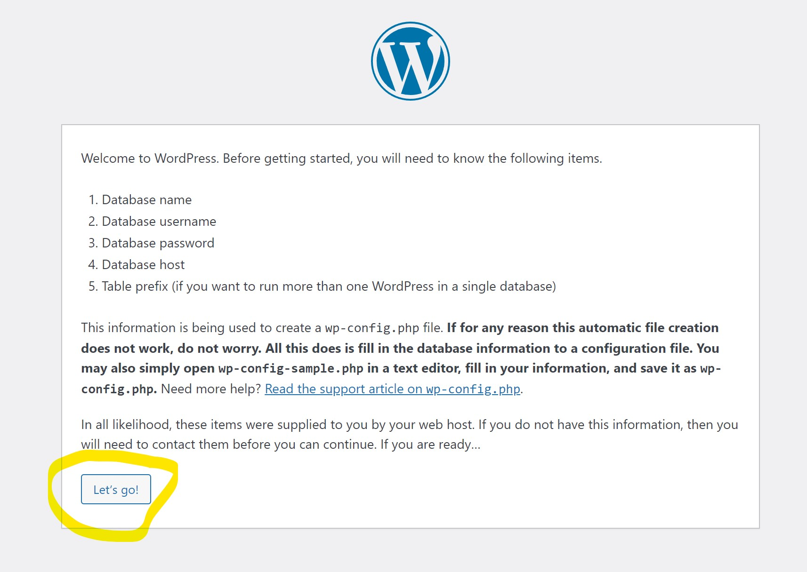

### Week four study note (4/30/2023 - 5/06/2023)<!-- omit from toc -->
- [Installing Wordpress using the LAMP stack.](#installing-wordpress-using-the-lamp-stack)
  - [Linux installation](#linux-installation)
  - [Apache Installation](#apache-installation)
  - [Mysql Installation](#mysql-installation)
  - [PHP Installation](#php-installation)
  - [Wordpress installation.](#wordpress-installation)

#### Installing Wordpress using the LAMP stack.
>LAMP Stack stands for `L`inux `A`pache `M`ysql `P`HP.
##### Linux installation
For this project we will be using Almalinux 9 running on a vmware workstation.

##### Apache Installation
* First step is to install the Apache package using the command:
    `sudo dnf install httpd`
* After that, we want to start the Apache service.
    `sudo systemctl start httpd`
* Then we need to enable the Apache service at system reboot.
    `sudo systemctl enable httpd`
* Next step is to allow Apache firewall access.
`sudo firewall-cmd --permanent --add-service={http,https}`
`sudo firewall-cmd --reload`

##### Mysql Installation
* Install Mysql
    `sudo dnf install mysql mysql-server -y`
* Start the mysqld service
    `sudo systemctl start mysqld`
* Enable the mysqld service
    `sudo systemctl enable mysqld`
* Configure mysqld through firewall
    `sudo firewall-cmd --permanent --add-service=mysql --zone=public`
    `sudo firewall-cmd --reload`
* Do the initial setup for mysql and setup mysql root user password.
    `sudo mysql_secure_installation`
* Create a database and database user that wordpress will use.
    `mysql -u root -p` to log into the mysql interface.
    ```mysql
    CREATE DATABASE shop_db;
    CREATE USER 'shopuser'@'localhost' IDENTIFIED BY 'passwordgoeshere';
    GRANT ALL ON shop_db.* TO 'shopuser'@'localhost';
    FLUSH PRIVILEGES;
    EXIT
    ```

##### PHP Installation
1. First we need to install PHP and all the dependencies it needs.
   `sudo dnf install php php-curl php-bcmath php-gd php-soap php-zip php-curl php-mbstring php-mysqlnd php-gd php-xml php-intl php-zip`
2. Download the latest Wordpress.
   `sudo wget https://wordpress.org/latest.zip`
3. Unzip the file into the right directory.
   `sudo unzip latest.zip -d /var/www/html/`
4. Change the ownership and permission of the website directory
   `sudo chown -R apache:apache /var/www/html/wordpress/`
   `sudo chcon -t httpd_sys_rw_content_t /var/www/html/wordpress -R`
5. Move the contents of `/var/www/html/wordpress` to the parent directory `html`

##### Wordpress installation.

1. Go to the ip address of your Linux Machine on the webbrowser.
2. If all previous configurations were done correctly, you should see the image below:
    
3. Input the database details we created on the mysql installation section.
    

4. You might get an error that wordpress couldn't write to `wp-config.php` file. As shown below:
   
   Follow the steps outlined below to fix that on the terminal.
   1. Navigate to the `/var/www/html` folder.
   2. Use an editor to create the file `wp-config.php`. 
      1. For example `sudo vi wp-config.php`
   3. Copy the content the wordpress installation gave you, and paste it into the `wp-config.php`. Verify that the database details are correct.
   4. Change the ownership of the newly created file.
        `sudo chown apache:apache wp-config.php`
5. Once the file is created click on Run the installation.
6. You should get a welcome page as shown below:
    

7. Fill out the details for the wordpress admin userm then click on Install Wordpress to complete the installation.
8. Once you log in, you should be taken to the admin dashboard:
    
