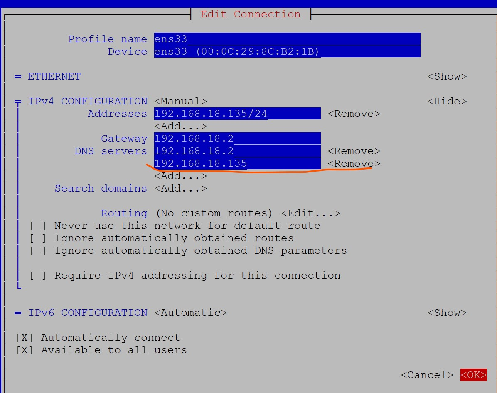

### Week five study note (5/07/2023 - 5/13/2023)<!-- omit from toc -->

#### DNS = Domain Name System
* Purpose of DNS
Hostname to IP resolution &rarr; (A Record)
IP to Hostname &rarr; (PTR Record)
Hostname to Hostname &rarr; (CNAME Record)

* Files
    `/etc/named.conf` &rarr; main configuration file for DNS
    `/var/named` &rarr; a directory that contains all the zone files and server definition.
* Services
  The main service for using a Linux Machine as a DNS server is `named`.

##### Configuring a DNS server on a Linux Machine.

* Install the required packages.
    `dnf install bind bind-utils -y`
* Configure the DNS server.
  This is done by editing the `/etc/named.conf` file.
  ```console
  listen-on port 53 {127.0.0.1;SERVERIP; }; #add the server's IP address.

  zone "." IN {
            type hint;
            file "named.ca";

  };
  #edit the zone definition above with your domain name, type and filename
  zone "lab.local" IN {
            type master;
            file "forward.lab";
            allow-update  {none;  };

  };
  # add reverse zone
  zone "1st_3PartOfIPInReverse.in-addr.arpa" IN {
            type master;
            file "reverse.lab";
            allow-update  {none;  };

  };

  ```
* Create Zone files
  `touch /var/named/{forward.lab,reverse.lab}`
* Add content to the zone files, examples are shown below.
>```console
>  #forward.lab content
>
>  $TTL 86400
>  @ IN SOA masterdns.lab.local. root.lab.local. (
>        2011071001 ;Serial
>        3600    ;Refresh
>        1800    ;Retry
>        604800  ;Expire
>        86400   ;Minimum TTL
>) 
>  @       IN      NS      masterdns.lab.local.
>  @       IN      A       192.168.18.135
>  masterdns       IN      A       192.168.18.135
>  web     IN      A       192.168.18.134
>
> #reverse.lab content
>$TTL 86400
>@       IN      SOA     masterdns.lab.local. root.lab.local. (
>                2011071001 ;Serial
>                3600 ;Refresh
>                1800 ;Retry
>                604800 ;Expire
>                86400 ;Minimum TTL
>)
>@       IN      NS      masterdns.lab.local.
>@       IN      PTR     lab.local.
>masterdns       IN      A       192.168.18.135
>135     IN PTR  masterdns.lab.local.
>134     IN PTR  web.lab.local.
>
>```
* Start the DNS service.
  `systemctl start named`

  `systemctl enable named`

* Allow DNS through firewall.
  `firewall-cmd --add-service=dns --permanent`

  `firewall-cmd --reload`
* Configure Permissions, Ownership and SELinux
```console
root in 🌐 lab in ~
❯ chgrp named -R /var/named

root in 🌐 lab in ~
❯ chown -v root:named /etc/named.conf
ownership of '/etc/named.conf' retained as root:named

root in 🌐 lab in ~
❯ restorecon -rv /var/named

root in 🌐 lab in ~
❯ restorecon /etc/named.conf
```
* Test DNS configuration and zone files for any syntax error
```console
root in 🌐 lab in ~
❯ named-checkconf /etc/named.conf

root in 🌐 lab in ~
❯ named-checkzone lab.local /var/named/forward.lab
zone lab.local/IN: loaded serial 2011071001
OK

root in 🌐 lab in ~
❯ named-checkzone lab.local /var/named/reverse.lab
zone lab.local/IN: loaded serial 2011071001
OK

```
* Add the DNS server IP to the Network configuration.
This can be accomplished using various methods, I will be using nmtui for this.
Remember to restart the network after making the edit.


* Add the DNS server IP to the client machine
This can be accomplished using nmtui.
