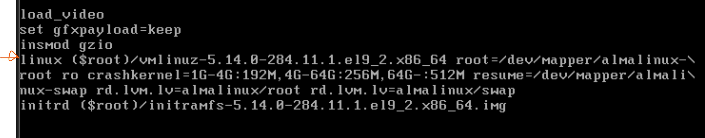

### Week seven study note (5/21/2023 - 5/26/2023)<!-- omit from toc -->
#### Reseting root password on RHEL9
This can be achieved on the system console.
1. Reboot the system
2. Interrupt the boot process by quickly pressing the &uarr; or &darr; keys and select your default kernel.
3. Press the `E` key on your keyboard to go into edit mode.
4. Scroll to the line that starts with Linux as shown below using the arrow keys then press the `END` key to get to the end of the line.

5. Add `rd.break` at the end of the line from step 4.
6. Press `CTRL + X` to reboot the system
7. Remount the `/sysroot` file system `mount -o remount,rw /sysroot`
8. Switch to the root user `chroot /sysroot`
9. Use the `passwd` command to change the password, it will ask you to enter the password twice to confirm.
10. If SELinux is enabled, then we need a way to let it know we changed the ROOT passwd. `touch /.autorelabel`
11. Type `EXIT` twice and the system should reboot and you can login using the root we just reset.